  
  
  # ⚡ YellowMeter OS
  
  **The Web3 Operating System for High-Frequency Actions**
  
  
  
  

---

## 💡 The Vision

Web3 has a usability crisis. Transactions are slow, expensive, and intimidating.
*   **Notion :** https://www.notion.so/YellowMeter-OS-301d2346b312802b9421f8c1a8e6c97f
*   **The Problem:** Building a decentralized chess game or a chat app is impossible if every move/message costs gas and takes 12 seconds to confirm.
*   **The Solution:** **YellowMeter OS**. A desktop-like interface that abstracts the blockchain complexity using **State Channels** and **Session Keys**. It feels like Web2, but settles on Web3.

```mermaid
graph TD
    %% Nodes
    User((User))
    subgraph Client [Frontend Layer]
        UI[YellowMeter OS Interface]
        Session[🔑 Session Key Manager]
        Wagmi[Wagmi / ENS Resolver]
    end
    
    subgraph Server [Backend Layer]
        API[NestJS API Gateway]
        Engine[⚡ Nitrolite Engine]
    end
    
    subgraph Blockchain [On-Chain Layer]
        Yellow[🟡 Yellow Adjudicator]
        ENS[🌐 ENS Registry]
    end

    %% Connections
    User -->|High Freq Actions| UI
    UI -->|Resolve Identity| Wagmi
    Wagmi -->|Query| ENS
    
    UI -->|Sign Channel State| Session
    
    %% Key Interaction
    Session == V3 Strict Protocol ==> API
    API == Validate & Counter-Sign ==> Engine
    
    %% Blockchain Settlement
    UI -.->|1. Deposit Funds| Yellow
    UI -.->|3. Settlement| Yellow
    
    Engine -.->|Virtual Balance Check| Yellow

    %% Styling
    style Yellow fill:#F7E025,stroke:#333,stroke-width:4px,color:black
    style Engine fill:#FFF9C4,stroke:#F7E025,stroke-width:2px,color:black
```

---

## ⚡ Powered by Yellow Network

Our core infrastructure is built on **Yellow Network**, enabling instant, gasless settlement for high-frequency interactions. We didn't just use an SDK; we built a custom implementation of the **Nitrolite** protocol.

### 🏗️ Architecture: The "State Channel" Engine

We use bidirectional state channels to create a secure off-chain tunnel between the User `(Client)` and the OS `(Server)`.

```mermaid
sequenceDiagram
    participant U as User (Wallet)
    participant S as 🔑 Session Key
    participant B as Backend (Nitrolite)
    participant C as 🟡 Adjudicator (Chain)

    Note over U, C: Phase 1: Opening (Gas Required)
    U->>C: Deposit MockUSDC
    C-->>U: Channel Created (ID: 0x123)
    U->>S: Generate Ephemeral Key

    Note over U, C: Phase 2: Transacting (Zero Gas)
    loop High Frequency Actions
        U->>S: Action: "e4" (Chess)
        S->>S: Sign State (Nonce+1)
        S->>B: Send Signed State
        B->>B: Validate Sig & Balance
        B-->>S: Counter-Sign (Receipt)
    end

    Note over U, C: Phase 3: Settlement
    U->>C: Close Channel (Final State)
    C->>U: Withdraw Remaining Balance
    C->>B: Pay Service Fees
```

1.  **On-Chain Opening:** The user deposits funds (MockUSDC) into the Yellow **Adjudicator Contract**.
2.  **Off-Chain Transacting:** All moves (Chess, Trading, AI Prompts) happen instantly off-chain.
3.  **On-Chain Settlement:** The channel closes with a single transaction reflecting the final balance.

### 🔐 Implementation Details

#### 1. Backend: The Nitrolite Counterparty
*Developed in NestJS + Ethers.js*

We implemented the **V3 Strict Signature Protocol** to validate thousands of transactions per second.
*   **Protocol Format:** `CHANNEL:{id}|NONCE:{t}|UBAL:{x}|SBAL:{y}`
*   **Validation Logic:** The backend reconstructs this string from the DTO, recovers the signer address, verifies the `Nonce` increment, and ensures the `ServerBalance` increases correctly before double-signing.
*   **Contracts Used:**
    *   **Adjudicator:** `0x019B65A265EB3363822f2752141b3dF16131b262`
    *   **MockUSDC:** `0x1c7D4B196Cb0C7B01d743Fbc6116a902379C7238`

#### 2. Frontend: Ephemeral Session Keys
*Developed in React 19 + Viem*

To eliminate wallet popups, we implemented **Browser-based Session Keys**.
*   **Key Generation:** When a channel opens, we generate a random private key stored in `localStorage`.
*   **Signing:** This key signs the **EIP-712 Typed Data** for every action (Move, Message) in the background.
*   **UX Result:** The user confirms *once* to login, then plays freely without interruptions.

---

## 🌐 ENS Integration (Identity Layer)

We integrated **ENS (Ethereum Name Service)** deeply into the OS to humanize every interaction.

### 💬 Usage in Messaging & Payments
YellowMeter OS includes a decentralized **Chat Application** powered by ENS.

1.  **Universal Resolution:**
    *   Users can start a chat by typing `nick.eth`.
    *   We use **Wagmi Hooks** to resolve the ENS name to an address instantly.
2.  **Reverse Resolution:**
    *   The OS "Taskbar" typically displays `0x12...F4`. We replace this with the user's Primary ENS Name and Avatar.
3.  **Hybrid Caching:**
    *   To ensure speed, we cache resolved identities in our Backend `users` table via an Upsert mechanism during the initial handshake.

---

## 🛠️ Technology Stack

| Component | Tech | Role |
| :--- | :--- | :--- |
| **Frontend** | React 19, Vite, Tailwind | The "OS" Interface |
| **Blockchain** | **Viem**, **Wagmi** | Session Keys, Typed Signatures |
| **Backend** | NestJS, Socket.IO | State Channel Node, Real-time Relay |
| **Database** | Supabase (PostgreSQL) | Persistence, Message History |
| **Network** | **Yellow Network (Sepolia)** | State Channels & Clearing |
| **Identity** | **ENS** | Naming & Avatars |

---

  <i>Created with ⚡ by the YellowMeter Team</i>

